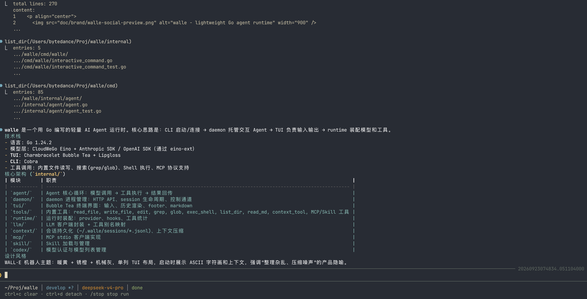

<p align="center">
  
</p>

<h1 align="center">walle</h1>

<p align="center">
  <strong>一个轻量的 Go Agent Runtime。</strong><br />
  连接模型，执行工具，保存会话，并把交互 Agent 托管在可 attach 的 daemon 中。
</p>

<p align="center">
  <a href="https://go.dev/"></a>
  <a href="https://github.com/cloudwego/eino"></a>
  
  
</p>

<p align="center">
  <a href="#快速开始">快速开始</a> ·
  <a href="#核心能力">核心能力</a> ·
  <a href="#运行方式">运行方式</a> ·
  <a href="#扩展能力">扩展能力</a> ·
  <a href="doc/0README.md">完整文档</a>
</p>


---

`walle` 是一个小而完整的 Agent 运行时。它适合放在真实项目目录里工作：读取上下文、调用工具、修改文件、执行命令，并把过程保存在本地 session 中。

它不试图做成平台，而是保留清楚的本地边界：CLI 负责启动和连接，daemon 托管交互 Agent，TUI 负责输入输出，模型和工具通过 runtime 装配。

```text
用户输入
   │
   ▼
TUI / CLI ──► daemon ──► Agent Runtime ──► LLM
                              ▲             │
                              │             ▼
                         工具结果 ◄── Tool Call
```

<p align="center">
  
</p>

## 核心能力

| 能力 | 说明 |
| --- | --- |
| 本地运行 | Go 实现，运行链路短，适合阅读、调试和二次开发。 |
| 工具调用 | 内置文件、搜索、Shell、上下文工具，支持多轮工具调用。 |
| 可分离交互 | daemon 托管交互 Agent，TUI 可以随时 attach / detach。 |
| 会话持久化 | 默认把对话消息保存到 `~/.walle/sessions/*.jsonl`。 |
| 上下文管理 | 支持 session、自动压缩和上下文工具，减少无关内容进入模型。 |
| 扩展能力 | 支持用户级 / 项目级 Skill，也可以接入 MCP Server。 |

## 快速开始

### 1. 安装

需要 **Go 1.24.2+**。Node.js 仅在部分 MCP Server 需要时安装。

```bash
git clone https://github.com/Ozqi/walle.git
cd walle
bash install.sh
```

安装脚本会把二进制安装到 `~/.local/bin/walle`，首次创建 `~/.walle/.env`。

如果终端找不到命令：

```bash
export PATH="$HOME/.local/bin:$PATH"
```

<details>
<summary>使用远程安装脚本</summary>

```bash
curl -fsSL https://raw.githubusercontent.com/Ozqi/walle/master/install.sh | bash
```

建议在执行前先查看脚本内容。

</details>

### 2. 配置模型

模型统一使用 `provider/model` 格式。先编辑 `~/.walle/.env`：

```env
LLM_MODEL=<provider>/<model>

LLM_<PROVIDER>_FORMAT=openai
LLM_<PROVIDER>_BASE_URL=https://example.com/v1
LLM_<PROVIDER>_API_KEY=sk-...
LLM_<PROVIDER>_MAX_TOKENS=4096
LLM_<PROVIDER>_STREAM=true
```

本地 OpenAI-compatible 服务可以把 API key 填成 `dummy`；远端网关按平台文档填写 `BASE_URL` 和 `API_KEY`。

单次启动也可以临时切换模型：

```bash
walle --model <provider>/<model>
```

完整配置见 [.env.example](.env.example) 和 [LLM 配置文档](doc/config/llm.md)。

### 3. 启动

在任意项目目录执行：

```bash
walle
```

进入 TUI 后直接描述任务即可。输入 `/` 查看命令，按 `Tab` 补全。

## 运行方式

### 默认入口

```bash
walle
```

默认入口会为当前 workspace 打开一个新的交互 Runtime；如果 daemon 不存在，会先在后台创建用户级 daemon。

如果要续接当前 workspace 最近的交互 Runtime 或最近 session，显式使用：

```bash
walle -c
```

### 查看和重新进入

```bash
walle ps
walle attach <process-id>
```

离开 TUI 后，后台 Agent 可以继续保留，之后通过 `attach` 回到指定交互进程。

### 手动启动 daemon

```bash
walle daemon
walle ps
walle attach <process-id>
```

`walle daemon` 作为用户级 supervisor 托管多个可 attach 的交互 Runtime，并默认通过本机 Unix Socket 提供控制面。多数情况下直接执行 `walle` 即可。

需要给浏览器、IDE 插件或脚本暴露本机网络接口时，可以显式开启 HTTP Gateway：

```bash
walle daemon --http --http-addr 127.0.0.1:0
```

HTTP Gateway 提供 JSON 短请求、WebSocket 交互流和 SSE 只读事件流；访问 token 默认写在 `~/.walle/run/http_token`，不会打印到日志或终端。

## 常用 TUI 命令

| 命令 | 用途 |
| --- | --- |
| `/provider [name]` | 选择 Provider 或完成认证。 |
| `/model <provider/model>` | 查看或切换当前模型。 |
| `/session <new\|list\|id>` | 新建、查看或切换会话。 |
| `/stop` | 停止当前 Agent 执行。 |
| `/skill <list\|get\|reload>` | 查看或重新加载 Skill。 |
| `/mcp <list\|add\|remove\|...>` | 管理 MCP 配置。 |
| `/compress` | 手动压缩当前上下文。 |
| `/detach` | 退出 TUI，但保留后台 Agent。 |

## Go SDK

外部 Go 程序可以直接嵌入 walle Runtime：

```go
import wallert "github.com/Ozqi/walle/runtime"

rt, err := wallert.New(ctx, wallert.Options{ProjectDir: "/path/to/workspace"})
if err != nil {
    return err
}
defer rt.Close()

result, err := rt.Run(ctx, "总结这个项目", wallert.WithEventHandler(func(event wallert.Event) {
    // 处理 assistant / thinking / tool / done / error / state 事件
}))
_ = result
```

SDK 会读取 `~/.walle` 配置并启用 walle 内置工具；模型可通过 `Options.ModelRef` 指定。它适合可信本地工作区，不是只读沙箱。详细说明见 [Runtime 文档](doc/runtime/runtime.md)。

## 扩展能力

### Skill

Skill 用来补充特定工作流和工具说明，可以放在用户目录或项目目录：

```text
~/.walle/skills/              用户级 Skill
<workspace>/.walle/skills/    项目级 Skill
```

详情见 [Skill 文档](doc/core/skill.md)。

### MCP

`walle` 当前提供 MCP 配置管理命令；默认 Runtime 启动不连接 MCP Server。显式接入时，MCP Server 可被注册为 Agent 可调用的 `mcp.<server>.<tool>` 工具：

```text
/mcp list
/mcp add ...
/mcp remove ...
```

详情见 [MCP 文档](doc/integrations/mcp.md)。

### ChatGPT OAuth

在 TUI 中输入 `/provider openai`，按提示完成浏览器登录，再用 `/model` 选择当前账号可用模型。

凭据保存在 `~/.walle/auth/codex.json`，不会写入项目目录、session 或 report。

## 项目结构

```text
cmd/walle/        CLI 入口
runtime/          对外 Go SDK
internal/
├── runtime/      daemon 托管的交互 Agent 装配层
├── agent/        ReAct 循环与工具调度
├── llm/          模型客户端与协议适配
├── tools/        内置工具与注册表
├── context/      上下文与 session
├── skill/        Skill 加载
├── mcp/          MCP 客户端
├── daemon/      Unix Socket、Runtime registry 与交互会话
└── tui/          Bubble Tea 客户端
doc/              设计与模块文档
prompt/           Runtime 提示词
```

## 开发

```bash
go build ./cmd/walle
go test ./...
```

建议从以下文件开始阅读：

1. [`cmd/walle/main.go`](cmd/walle/main.go)：CLI 入口
2. [`internal/runtime/runtime.go`](internal/runtime/runtime.go)：Runtime 装配
3. [`internal/agent/agent.go`](internal/agent/agent.go)：Agent 主循环
4. [`internal/tools/registry.go`](internal/tools/registry.go)：工具注册

## 文档

- [文档索引](doc/0README.md)
- [Runtime](doc/runtime/runtime.md)
- [Agent 主循环](doc/core/agent.md)
- [Context 与 Session](doc/core/context.md)
- [Skill](doc/core/skill.md)
- [Tools](doc/integrations/tools.md)
- [MCP](doc/integrations/mcp.md)
- [TUI / CLI](doc/interface/cli.md)
- [LLM 配置](doc/config/llm.md)
