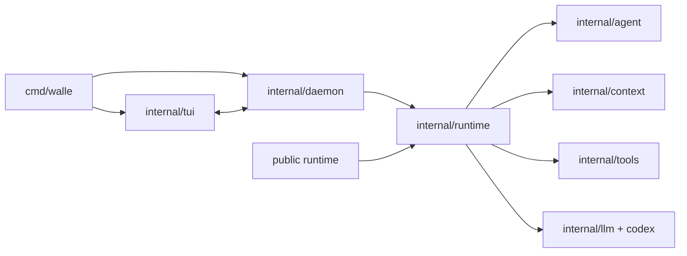

# walle 文档

## 模块

| 模块 | 文档 |
| --- | --- |
| Runtime / SDK | [runtime/runtime.md](runtime/runtime.md) |
| Daemon | [runtime/daemon.md](runtime/daemon.md) |
| Agent | [core/agent.md](core/agent.md) |
| Context / Session | [core/context.md](core/context.md) |
| Skill | [core/skill.md](core/skill.md) |
| TUI / CLI | [interface/cli.md](interface/cli.md) |
| Commands | [interface/commands.md](interface/commands.md) |
| Logger / ToolEvent | [interface/logger.md](interface/logger.md) |
| Tools / MCP | [integrations/tools.md](integrations/tools.md)、[integrations/mcp.md](integrations/mcp.md) |
| LLM | [config/llm.md](config/llm.md) |
| 拓扑 | [topology.md](topology.md) |

稳定事实：默认 `walle` 新建 Runtime，`-c` 才续接；daemon 只使用 Unix Socket；Runtime 不包含任务调度或 report/worklog；public SDK 只提供直接执行。
