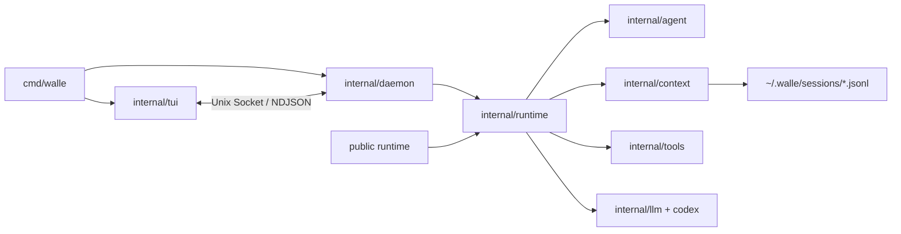

# walle 架构拓扑

- Daemon 持有 Runtime registry、交互 session、provider picker 和 OAuth。
- Runtime 只装配并执行 Agent。
- TUI 只输入和渲染。
- Public SDK 直接调用 Runtime，不复用 daemon 协议。

持久化只有用户配置、prompt、session、daemon socket 和工具失败记录；没有通用 process report/worklog。
